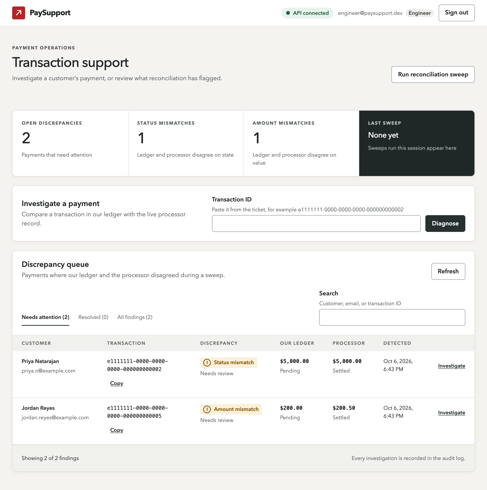
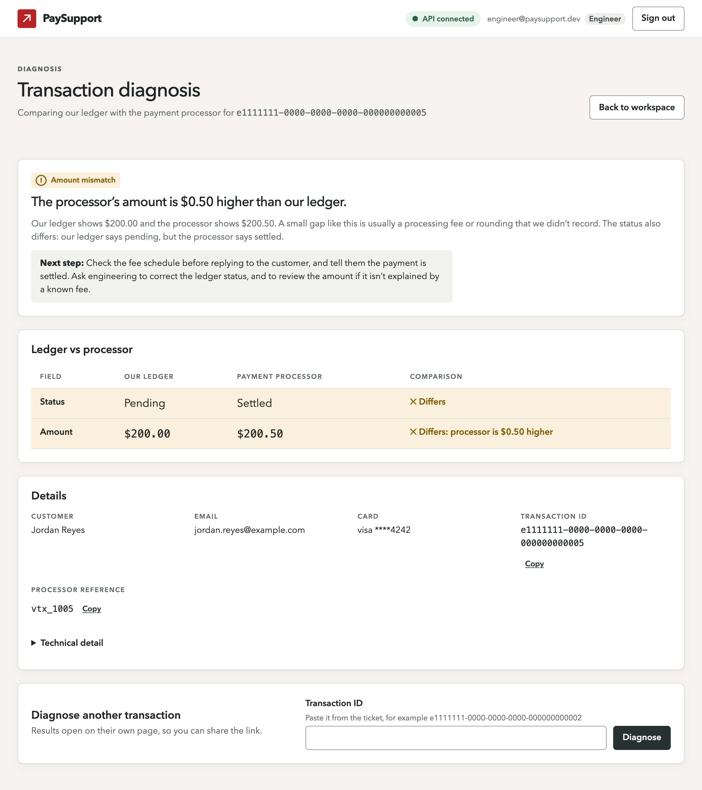
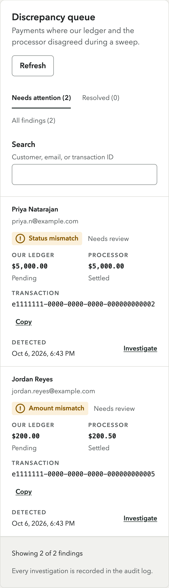
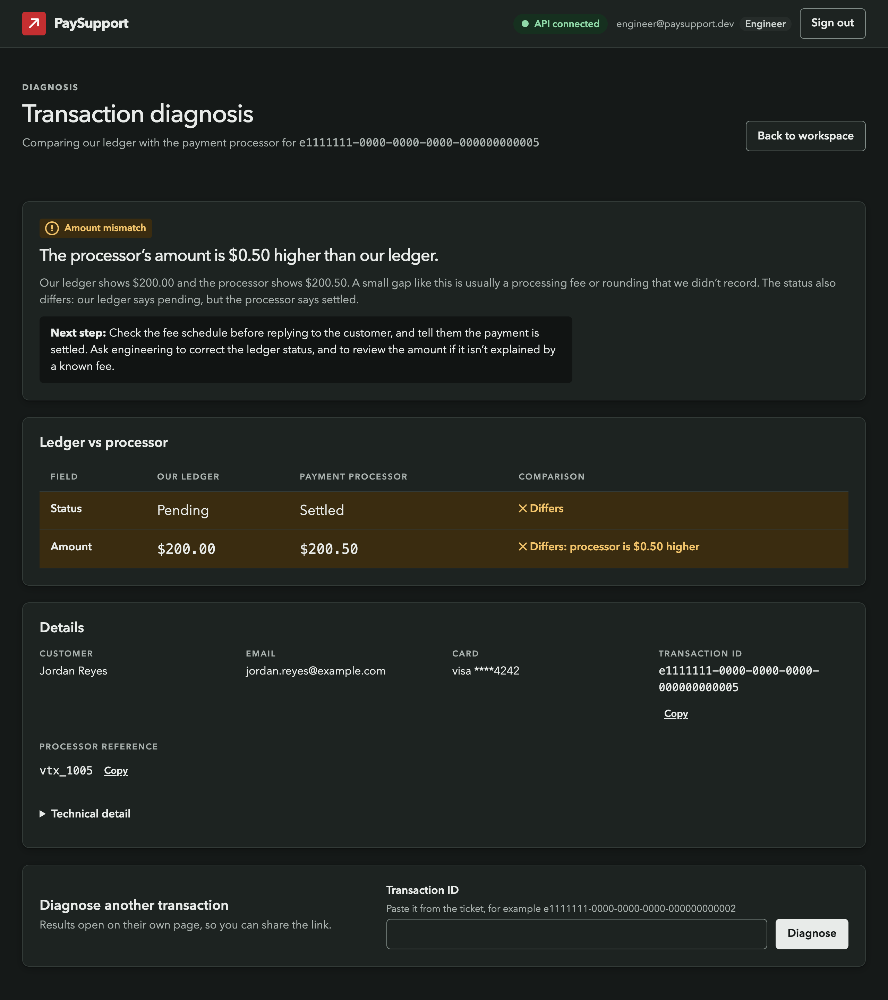

# PaySupport Dashboard

I built PaySupport because I wanted to apply for a support engineering role, and I didn't want to just say I understood the job. I wanted to build the tool I'd want on my first day.

I've spent more than ten years helping people untangle problems with services they depend on. Right now that's as an Operations Lead, where most of my day is time-sensitive problems with someone waiting on the other end. So when I imagined a support engineer opening this dashboard, I didn't picture someone calmly exploring it. I pictured someone mid-ticket, with a customer asking where their money went.

That person shaped almost every decision in here.



## What it does

PaySupport compares our internal payment ledger with what the payment processor actually recorded, and explains the difference in plain language. (The API, database, and processor mock live in the [repo root](../README.md); this folder is the dashboard.)

An engineer can:

- **Paste a transaction ID from a ticket** and get a verdict, an explanation, and a next step, with our ledger and the processor side by side.
- **Share that result.** Every diagnosis has its own URL, so it can go straight into the ticket.
- **Work through the discrepancy queue,** filtered by status and searchable by customer, email, or transaction ID.
- **Run a reconciliation sweep** (engineers and admins only) to check recent payments against the processor in bulk.



## Designing for someone in the middle of a ticket

**The answer comes first.** A diagnosis opens with a badge, one sentence saying what's wrong, and a highlighted "Next step". The raw comparison comes after that, and the API's own developer notes are folded away under "Technical detail". Under pressure, nobody wants to decode `20000c vs 20050c`.

**I wrote the copy for the person reading it.** Every outcome has its own explanation. "Processor unavailable" was the one I thought about most: it says *don't tell the customer anything has gone wrong*, because a timeout isn't a failed payment, and saying the wrong thing to a worried customer is its own incident.

**Looking at real data caught something the tests didn't.** While reviewing a real result, I noticed a payment flagged as an "amount mismatch" ($0.50 fee) where the *status* was also wrong: our ledger said pending, the processor said settled. The API only reports the first problem it finds, so the verdict was telling the engineer to explain a fee while the customer's actual question ("why does it still say pending?") went unanswered. Now the verdict checks both and says so. There's a test for that exact payment.

**Red is only for the brand.** In a payments tool, red means "error". If the primary buttons were red, "Diagnose" would look destructive and real errors would look clickable. So actions are ink, red is the logo mark, and "info" (like a processor outage) is slate blue, so it never reads as a failure.

**Status is never colour alone.** Every badge has a word and an icon with its own shape. Rows that differ say "Differs: processor is $0.50 higher" in text, not just in a tinted row.

**Empty states explain themselves.** An empty queue says *why* it's empty and what to do next, and the advice is different for support staff (who can't run sweeps) and engineers (who can). The "Resolved" tab explains that resolving isn't possible in the app yet, instead of quietly looking broken.

**Expensive things ask first.** A sweep can make 100 processor requests and take up to two minutes, so it sits behind a confirmation that says exactly that. Focus lands on Cancel, so pressing Enter by reflex does the safe thing.

**Support staff aren't shown a dead button.** Instead of a greyed-out "Run sweep" (which keyboard and screen reader users can't even reach to find out why), they see a sentence saying sweeps are run by engineers and admins.

**IDs are never truncated.** A shortened ID can't be pasted into a query or a ticket. Every ID is shown in full, in monospace (so 0 and O don't get confused), with a one-click copy.

**It works on a phone.** Below tablet width, the queue turns into cards, so a finding reads top to bottom instead of scrolling sideways.

<p>
  
</p>

## Security decisions

My degree focused on cybersecurity, so I tried to treat security as part of the design rather than a checklist at the end. Each of these has a comment in the code explaining the threat it's there for.

- **The session token lives in memory only.** It's never in `localStorage`, `sessionStorage`, or a cookie, and it isn't even exposed to components, so an XSS bug can't read it and no component can log it. The tradeoff is real: refreshing the page signs you out. The production answer is an httpOnly, Secure, SameSite cookie from the API, which needs backend work I've documented rather than half-built.
- **The API is treated as untrusted input.** Every response is validated at runtime with Zod before the UI touches it. Unknown fields are dropped, and a malformed token is rejected before it can reach an `Authorization` header.
- **A strict Content Security Policy** on production builds: scripts, styles, and requests only from our own origin. I didn't just write it, I tested it. In the real production build, I injected an inline script into the live page, and the browser refused to run it.
- **The lint rules make unsafe code fail the checks.** `dangerouslySetInnerHTML`, inline styles, `localStorage`, calling `fetch` outside the API client, and `console` are all banned, so a future change can't quietly bring them back.
- **Small things that add up:** transaction IDs are URL-encoded so `../accounts` can't change which endpoint is called; the "return to where you were" redirect after sign-in only accepts in-app paths (no open redirect into a phishing page); responses aren't cached on shared support machines; and a slow 401 from an *old* session can't sign out the person who just signed back in.
- **The browser is a convenience, the API is the boundary.** Hiding the sweep button from support staff is UX. The real check is the API's 403, and the dashboard explains that 403 in plain language if anyone reaches it.

## Accessibility

I aimed for **WCAG 2.2 AA**, and I tried to treat it as engineering rather than polish.

- **Automated checks with axe** run against every page in every state I could reach: errors, empty states, the sweep dialog, the support role. There's also a "canary" test that renders something deliberately broken and *must* fail. A check that can't fail proves nothing.
- **The rest of the tests find things the way a screen reader does,** by role and accessible name ("the button called Show password"), not by CSS class. That caught real bugs: a button and a link were announcing themselves as "Showpassword" and "InvestigatePriya", because accessible names trim the spaces at the edges of hidden text. Invisible on screen, and easy to miss by hand.
- **Contrast is calculated, not eyeballed.** Every colour pair in [`tokens.css`](src/styles/tokens.css) has its ratio noted, in both light and dark mode. (axe can't measure contrast in a test environment, so I didn't pretend the tests cover it.)
- **The basics, done carefully:** a skip link, a visible focus ring everywhere, real labels on every field, errors linked to their fields with focus moved to the first one, async results announced through live regions, 44px touch targets, and reduced motion respected.
- **Focus follows navigation.** In a single-page app, nothing tells a screen reader the page changed, so focus moves to each new page's heading and every page sets its own tab title.

Automated tests can't tell you whether copy makes sense or whether a flow feels right, so I also checked the app by keyboard and by reading it as a first-time user.



## How it's built

React 19 and strict TypeScript on Vite, with React Router and Zod. Four runtime dependencies in total. Styling is plain CSS built on design tokens (colour, spacing, type, motion) with light and dark themes, so nothing hardcodes a value.

```
src/
  api/          one typed client (timeouts, auth, error mapping), Zod schemas, endpoint functions
  auth/         in-memory session, protected routes, safe redirects
  components/   shared pieces: app shell, badges, copy button, confirm dialog, form fields
  features/     sign-in, the workspace (metrics, lookup, queue, sweep), and diagnosis
  lib/          formatting (money from cents, dates) and ID checks
  styles/       design tokens and base styles
```

Components never call `fetch`. Everything goes through one client that returns a typed result instead of throwing, so every failure (network, timeout, 401, 403, 404, a response that doesn't match the schema) is a case the UI has to handle explicitly, with its own plain-language message.

## Running it

You'll need the API running first (see the [root README](../README.md); `docker compose up -d` from the repo root is the quickest) and Node 22.22 or newer.

```bash
cd web
npm install
npm run dev
```

Then open `http://localhost:5173`. In development, Vite proxies `/api` to the API on port 4000. Demo accounts are listed on the sign-in page in development builds only (they're stripped from production builds).

```bash
npm run check      # typecheck, lint, and all tests
npm run build      # production build, with the Content Security Policy
npm run preview    # serve the production build locally
```

## Testing

147 tests with Vitest, Testing Library, and MSW. The tests drive the app the way a person would (sign in, paste an ID, click Retry) against a mocked API, rather than testing implementation details. They cover every diagnosis outcome, sign-in and session expiry, the sweep and its confirmation, both roles, and the loading, empty, and error states, plus the axe checks above.

## What I'd do next

- **Move the session to an httpOnly cookie,** with a logout endpoint and CSRF protection, so refreshing doesn't sign you out.
- **Let engineers resolve discrepancies** from the queue. That needs an API endpoint, which doesn't exist yet.
- **Paginate the queue on the server.** It loads every finding at once, which is fine for a demo and not for a real backlog.
- **Send the CSP as an HTTP header** so it can include `frame-ancestors` (clickjacking protection), which a `<meta>` tag can't.

## What I learned

Honestly, the part I'm proudest of is the stuff nobody would notice if I'd skipped it.

Reviewing a real screenshot taught me more than some of the tests did: the hidden status mismatch was right there in the data, and no test would have caught it because I hadn't thought to write one yet. The accessibility tests taught me the opposite lesson: some bugs are invisible until something checks for them on purpose.

I also learned to debug things I didn't write. The backend's test runner hung silently on my version of Node, and I traced it down to the child processes it was waiting on before deciding how to fix it. That kind of digging is most of what support engineering is, and it was good practice.
